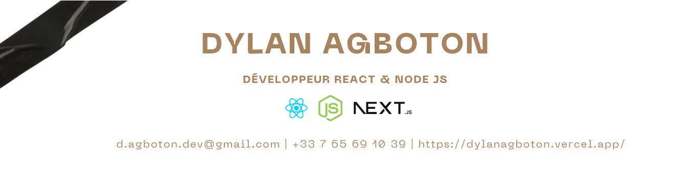

# 👋 Bienvenue sur mon GitHub !

---

## 🧠 Développeur React & Node JS

Je m'appelle **Dylan**, passionné par le développement web, la tech et les projets qui ont du sens.  
Je crée des idées en applications web modernes, fluides et sécurisées.

### 🚀 Mon quotidien c’est :

- 🧱 Construire des interfaces élégantes avec React + Tailwind.
- 🛠️ Créer des APIs robustes avec Node.js, Express et PostgreSQL.
- 🔐 Implémenter des systèmes d’authentification sécurisés avec JWT.
- ⚙️ Travailler proprement avec Git, GitHub, Notion, et Figma.
- 💡 Innover avec passion, apprendre sans relâche et partager mes projets.

---

## 🛠️ Stack technique

### 🎨 Frontend

### 🧩 Backend

### 🧰 Outils & Autres

---

## 🤝 Me contacter

Tu veux lancer un projet, me proposer une mission freelance, ou simplement discuter dev ?  
📬 Passe par [LinkedIn](https://www.linkedin.com/in/dylan-agboton/) ou envoie-moi un message.

---

**"Créer, itérer, apprendre, recommencer."**

---

